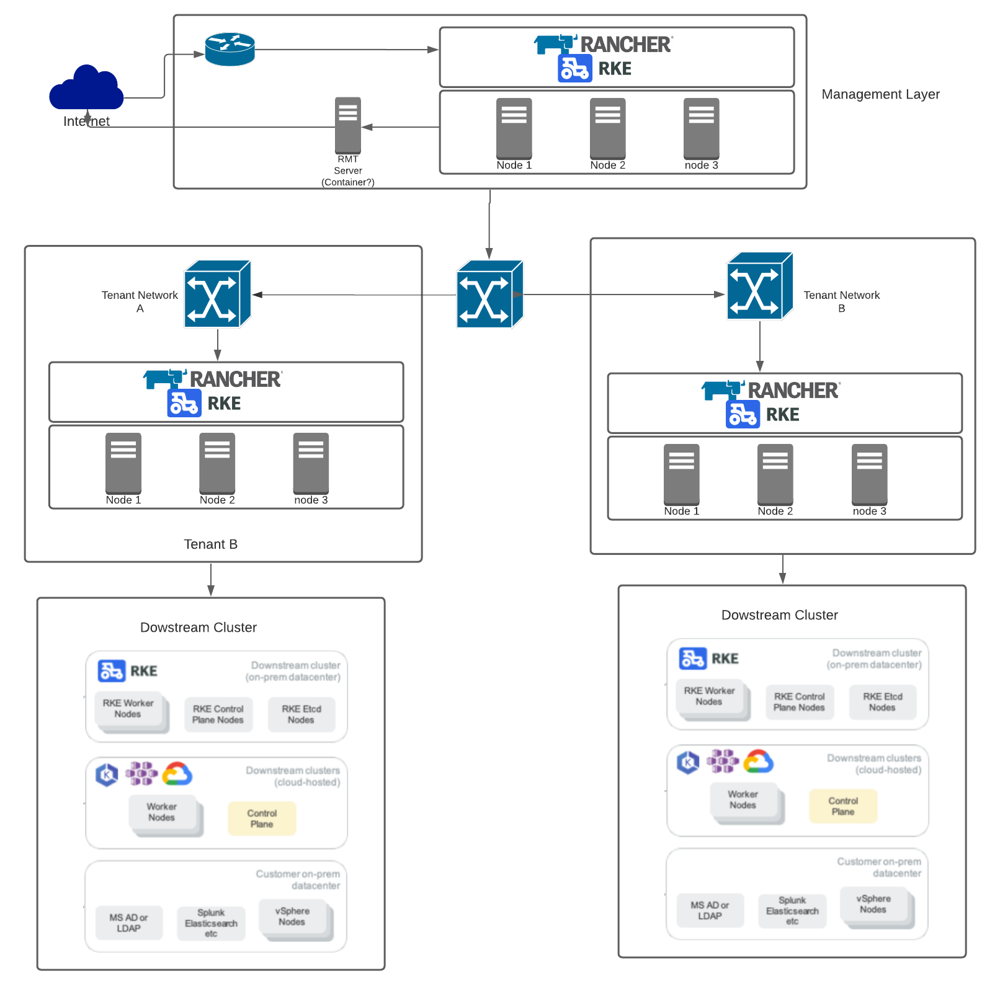

# Rancher and RKE for MSPs

The purpose of this script is to deploy an architecture that MSPs canuse to offer Kubernetes management as a service based on Rancher and RKE. The idea is to deploy a management cluster/layer that deploys a downstream cluster with rancher deployed. Each customer gets access to its own rancher instance and can create its own downstream clusters. 
The idea is for the MSP to only care about the kubernetes infrastructure of the customers.



This deployment creates the following:
Management Layer:

* 1x NGINX Loadbalancer
* RKE Nodes leveraging Embedded HA, forming a K8s Cluster
* Installation of `Cert-Manager` and `Rancher` 

Tenant Layer:

* RKE Nodes leveraging Embedded HA, forming a K8s Cluster
* TODO: Installation of `Cert-Manager` and `Rancher` 
* Tpdp: Installation of nginx per customer

# Prerequisites

* Prior to running this script:
    * This TF integrates with VAULT to store the API keys for rancher so make sure you have a vault account somwehere.
    * A DNS record, for accessing rancher on the management layer, needs to be created to point at the Loadbalancer IP address, defined in the variable `lb_address`. 
    * (later when  the Nginx lb is created for each customer) A DNS record for each customer access to its rancher instance
    * The VM template used must have 
        * The `Cloud-Init Datasource for VMware GuestInfo` project installed, which facilitates pulling meta, user, and vendor data from VMware vSphere's GuestInfo interface. This can be achieved with:
        ```
        curl -sSL https://raw.githubusercontent.com/vmware/cloud-init-vmware-guestinfo/master/install.sh | sh -
        ```
    * For SLES vms:
      * Install the following packages before creating a template(later I will add salt formulas to prepare the images):
        * docker (from the container module)
          *  To install run the following:
          ```
          sudo SUSEConnect -p sle-module-containers/15.2/x86_64 -r ''
          sudo zypper in -y docker
          sudo systemctl enable docker.service
          sudo systemctl start docker.service
          ```
       * cloud-init (from the public cloud module):
         * To install run the following:
         ```
         sudo SUSEConnect -p sle-module-containers/15.2/x86_64 -r ''
         zypper in -y cloud-init
         systemctl enable cloud-init
         ```
        * Clean up the vm before creating the template:
        ```
        sudo rm -f /etc/SUSEConnect
        sudo rm -rf /etc/zypp/credentials.d/*
        sudo rm -rf /etc/zypp/repos.d/*
        sudo rm -f /etc/zypp/services.d/*
        SUSEConnect --de-register
        SUSEConnect --cleanup
        zypper in clone-master-clean-up
        clone-master-clean-up
        ```
      * Get a Registration KEY from SCC to activate the nodes. This will be stored in the reg_key and reg_email variables 

# Instructions

* Copy `variables.tfvars.example` as `variables.tfvars`
* Populate as you see fit
* Apply with `terraform apply`
* Once comple, Terraform will output the URL for Rancher, IE:

```
Apply complete! Resources: 9 added, 0 changed, 0 destroyed.

Outputs:

rancher_url = https://rancher.virtualthoughts.co.uk
```
# Roadmap
I am planning the following integrations as well(feel free to comment):
* Install ramcher on the downstream clusters with nginx load balancer
* Deploy tenant in separate network
* Separate the tenant creation as a separate TF